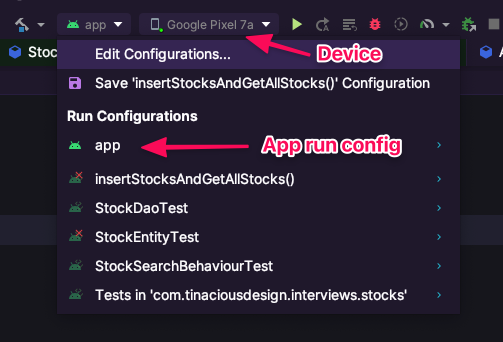
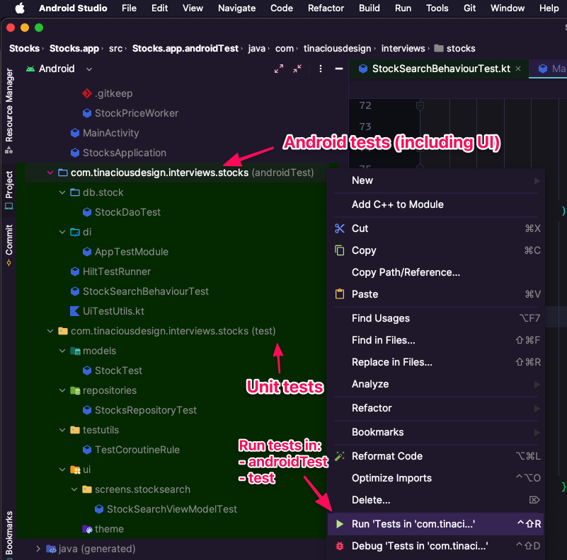
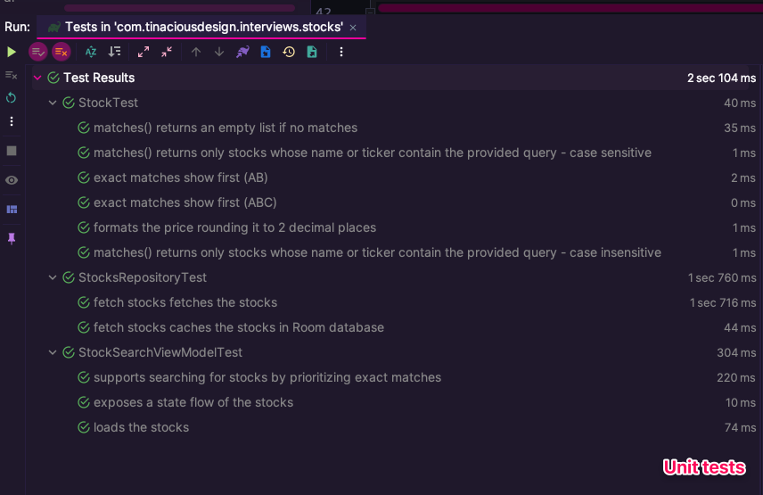
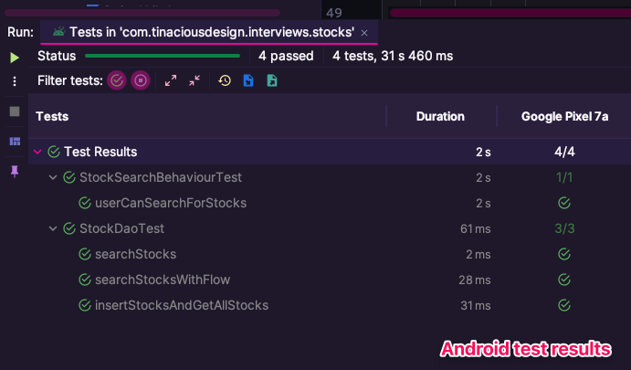

# Stocks

This is a sample stock search app for Android built with Jetpack Compose and various other [libraries](#libraries).


- [About this Guide](#about-this-guide)
- [Setup](#setup)
  - [Requirements](#requirements)
  - [Building](#building)
  - [Unit and UI tests](#unit-and-ui-tests)
- [Features](#features)
- [Libraries](#libraries)
- [Architecture Walkthrough](#architecture-walkthrough)
  - [Unit test walkthrough](#unit-test-walkthrough)
  - [Android test walkthrough](#android-test-walkthrough)
- [App Screenshots](#app-screenshots)
  - [App icon](#app-icon)
  - [Search results](#search-results)
  - [Empty states](#empty-states)
  - [About screen](#about-screen)
- [Install](#install)


## About this Guide

This guide assumes that you have experience in Android Development and are familiar with Android Studio and the command line tools.

## Setup

### Requirements

- [Android Studio](https://developer.android.com/studio) version Android Studio Jellyfish | 2023.3.1 Patch 1 or greater
- [Android command line tools](https://developer.android.com/tools)


### Building

You can build the app either in Android Studio or the command line (requires the command line tools mentioned above).

Build the app from the command line using:

    ./gradlew assemble

Install the debug build to your connected device:

    adb install app/build/outputs/apk/debug/app-debug.apk

The screenshot below shows that you need to choose the "app" build configuration and your chosen device. This section is in the top bar of the Android Studio UI.




### Unit and UI tests

You can run the tests either in Android Studio or the command line (requires the command line tools mentioned above).


Run the tests in Android Studio by visiting the `test` and `androidTest` folders at `./app/src/test` and `./app/src/androidTest` respectively. Right click and choose `Run tests in com.tinaciousdesign.interviews.stocks`.

Run the unit tests from the command line with the following command:

    ./gradlew test

Run the UI tests from the command line with the following command:

    ./gradlew connectedCheck --stacktrace

Below is a screenshot of the Android Studio UI and where to find these tests. This view is in the tree explorer view of Android Studio using either "Android" or "Project" versions of the tree explorer view.




## Features

- 📈 Loads stocks from an API endpoint
- 🛜 Enables offline access to stock searching, provided that stocks had initially loaded from the API while there was a connection
- 🌝 Supports light and dark mode using the user's system preference setting
- 🗺️ Bottom navigation to enable navigating to different screens
- 🍫 Snackbar UI to enable global alert messages
- 🤖 Unit tests and Android tests, including tests for the UI and the persistence layer
- 🫙 Empty states


## Libraries

The following libraries were used for the project:

- [Jetpack Compose](https://developer.android.com/compose): Android's new declarative UI framework and Google's recommended way to build Android apps going forward.
- [Room Database](https://developer.android.com/jetpack/androidx/releases/room): On-device database storage using a SQLite database and the Room database ORM, a library by Google for a SQL-based on-device persistence layer.
- [Hilt](https://developer.android.com/training/dependency-injection/hilt-android): Compile-time dependency injection library by Google that uses Dagger. This is used to inject dependencies into Android components (e.g. Application, Activity, View Model, WorkManager classes, etc.) Test helpers for Hilt were also included to enable unit and instrumentation tests for Android components using Hilt.
- [JUnit](https://junit.org/junit4/) for unit testing and instrumented Android tests
- [Compose UI testing](https://developer.android.com/develop/ui/compose/testing) for instrumented UI tests that include UI interactions like tapping elements, filling out forms, and waiting for views to appear.
- [Mockk](https://mockk.io/): A mocking library for Kotlin with support for coroutines, making it possible to test suspending functions.
- [Turbine](https://github.com/cashapp/turbine): A testing library by Square that makes it easier to test Kotlin coroutine flows.
- [Navigation Compose](https://developer.android.com/develop/ui/compose/navigation): Type-safe navigation library for Jetpack Compose, by Google. This is used to support navigation globally in the app.
- [Timber](https://github.com/JakeWharton/timber): Production-grade logging library by Square. This is used to log to the console and can also be used in production apps to log to exception tracking services.
- [Retrofit](https://square.github.io/retrofit/): Networking library by Square. This is used to make network requests to the API endpoint.
- [kotlinx-serialization](https://github.com/Kotlin/kotlinx.serialization): Kotlin standard library serialization library and compiler plugin. It's used to support serializing JSON from network requests.
- [Coil](https://coil-kt.github.io/coil/): Image loading library with support for Jetpack Compose for loading remote images. This is used to load the placeholder images for the stocks.


## Architecture Walkthrough

I decided to build the app using Android's [Jetpack Compose](https://developer.android.com/compose) framework with MVVM architecture and Kotlin flows.

I used the [Hilt](https://developer.android.com/training/dependency-injection/hilt-android) dependency injection library to make it easier to work with all of the various dependencies as well as enable the app to be more easily tested. There was also another option I've enjoyed using called [Koin](https://insert-koin.io/), and while it's simpler to set up and work with than Hilt (especially in production apps with various Android components and services), I opted to go with Hilt because it's by Google and offers more compile-time assurances. Dependency injection is currently configured as a single module `AppModule` at `app/src/main/java/com/tinaciousdesign/interviews/stocks/di/AppModule.kt`. In a production app, it may make sense to split it up into multiple modules which can make it easier for testing.

I used [Room Database](https://developer.android.com/jetpack/androidx/releases/room) as the local persistence layer to cache stock prices to enable more efficient searching. This also enables using the app offline. Another option I've used in the past is [Realm](https://github.com/realm), a cross-platform noSQL-based on-device database, though I opted to go with Room as it's officially by the Google Android team. Classes related to the database can be found in `app/src/main/java/com/tinaciousdesign/interviews/stocks/db`, which is where the Room database along with the Stock Data Access Object (DAO) and entity are configured.

```text
app/src/main/java/com/tinaciousdesign/interviews/stocks/db
├── AppDatabase.kt
└── stock
    ├── StockDao.kt
    └── StockEntity.kt
```

I'm using a repository pattern. The `StocksRepository` accesses Room database and the network API and exposes suspending methods and flows for accessing all of the stock data, as well as filtering stock data by a search query. It implements a Retrofit service which accesses the API endpoint. The Retrofit services are configured with a custom `OkHttpClient`, making it easy to add request and response interceptors. You can see a logging interceptor was added as an example. Networking code, including a custom `ApiResult` sealed class, can be viewed in `app/src/main/java/com/tinaciousdesign/interviews/stocks/networking`:

```text
app/src/main/java/com/tinaciousdesign/interviews/stocks/networking
├── ApiError.kt
├── ApiResult.kt
└── api
    └── StocksApi.kt
```

The app is scaffolded with a bottom navigation bar and support for global alert messages using Android's [Snackbar](https://developer.android.com/develop/ui/compose/components/snackbar) component. Navigation is implemented using Jetpack Compose's new type-safe navigation component. The implementation can be viewed in `app/src/main/java/com/tinaciousdesign/interviews/stocks/navigation`:

```text
app/src/main/java/com/tinaciousdesign/interviews/stocks/navigation
├── BottomNavigationBar.kt
├── NavigationRouter.kt
└── Route.kt
```

The app uses an EventBus pattern for platform-agnostic event-based programming that leverages Kotlin coroutine flows, which can be useful for listening to events across the app. You can toggle your internet on and off to view the Snackbar messaging. The snackbar duration is set to "long" to make it easy for people to test when toggling airplane mode on and off, but in a production app should be set to "short" since they can continue to use the app with the cached prices. Event-related code is in the directory `app/src/main/java/com/tinaciousdesign/interviews/stocks/events`, which includes the `EventBus` which publishes and subscribes to `AppEvent`, and a compose-based utility for observing events in composable components (`ObserveAsEvents`):

```text
app/src/main/java/com/tinaciousdesign/interviews/stocks/events
├── AppEvent.kt
├── EventBus.kt
└── ObserveAsEvents.kt
```

Constants are defined in `AppConfig`. In a production app, the app would have [multiple build variants called product flavours](https://developer.android.com/build/build-variants) and would be configured to build separate production, staging, and development artifacts. An `AppConfig` would be provided for each of these with their respective values. We can also use product flavours to configure other things based on the environment, like the app icon.

Logging has been added in `app/src/main/java/com/tinaciousdesign/interviews/stocks/logging` which includes configuration for Timber and a placeholder for production logging:

```text
app/src/main/java/com/tinaciousdesign/interviews/stocks/logging
├── CrashReportingTree.kt
├── DebugConsoleLoggingTree.kt
└── Logger.kt
```

The composables are split up into separate directories for screens, components, and icons.

- Common components are in `components`
- Icons that can be reused across screens are in `icons`
- Screens are (usually) root-level components. 
 
The `ui` package also includes utilities for working with various Android elements, as well as test tags to make it easy to access elements for instrumented UI tests.

Other utility functions are available in `app/src/main/java/com/tinaciousdesign/interviews/stocks/utils`.

Tests are split up into 2 separate directories, `test` and `androidTest`:

- `test` is where platform-agnostic unit tests can be found
- `androidTest` is where unit tests that use Android components are. This is where you can find tests for Room database queries and instrumented UI tests that test the stock searching flow.


### Unit test walkthrough

Unit tests are available in `app/src/test/java/com/tinaciousdesign/interviews/stocks`:

```text
app/src/test/java/com/tinaciousdesign/interviews/stocks
├── models
│   └── StockTest.kt
├── repositories
│   └── StocksRepositoryTest.kt
├── testutils
│   └── TestCoroutineRule.kt
└── ui
    └── screens
        └── stocksearch
            └── StockSearchViewModelTest.kt
```

- **StockTest**: tests for the `Stock` model including formatting data for the UI, and filtering and sorting the model. While the filtering logic here did not end up getting used and was replaced by a Room database query, it can still be useful for filtering a collection of stocks in-memory. This test also tests the custom comparator which was implemented to support the criteria that exact matches for the ticker or name are prioritized above partial matches. While I wasn't able to see which data would enable me to test this in the app, it is unit tested, and a separate endpoint was added to the code, which can be commented in in-place of the default one (see `com/tinaciousdesign/interviews/stocks/networking/api/StocksApi.kt` and enable the code `@GET("tinacious/a3ddc32e49c04b5de21e4bb30eb47e68/raw/5b590f6f369fb92fc49e33a14ab2275eb5629c24/mock-stocks.json")`).
- **StocksRepositoryTest**: tests for the repository layer including testing that we can make API calls with Retrofit and cache the data to Room database.
- **StockSearchViewModelTest**: tests that the data is queried when the view model has its `loadStocks()` method called and that stocks are available on the exposed `stocks` StateFlow. It also includes tests for the sorting prioritization logic with a mock repository.

Below is a screenshot of the unit test results.




### Android test walkthrough

Android tests are available in `androidTest` at `app/src/androidTest/java/com/tinaciousdesign/interviews/stocks`:

```text
app/src/androidTest/java/com/tinaciousdesign/interviews/stocks
├── HiltTestRunner.kt
├── StockSearchBehaviourTest.kt
├── UiTestUtils.kt
├── db
│   └── stock
│       └── StockDaoTest.kt
└── di
    └── AppTestModule.kt
```

- **HiltTestRunner** and **AppTestModule** are Hilt-related utilities for helping with instrumented tests in projects that use Hilt
- **StockDaoTest**: Tests for the Room database implementation which test that we can insert records, get all records, and query records. It includes the suspending methods as well as the flow which is the one the search screen uses.
- **StockSearchBehaviourTest**: This is an instrumented UI test that tests the behaviour of loading up the app and searching. It makes a real network request to fetch the data and uses an in-memory database. 

Below is a screenshot of the Android test results including database tests and UI tests.




## App Screenshots

### App icon

 

### Search results


### Empty states


### About screen


## Install

You can clone the source and build with the provided instructions above, or you can use [adb](https://developer.android.com/tools/adb) to install a debug build APK available in [Releases](https://github.com/tinacious/stocks-android-jetpack-compose/releases).
